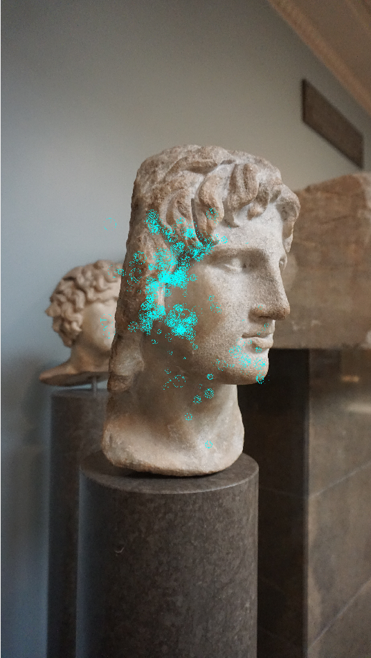
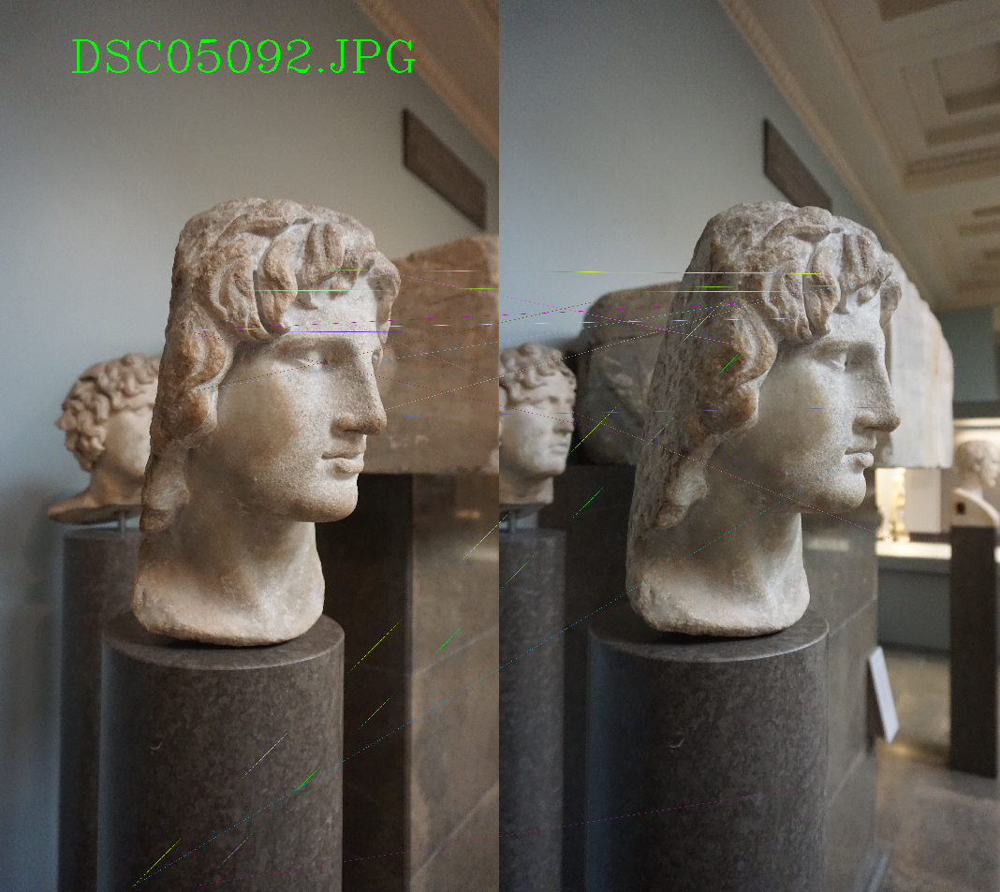
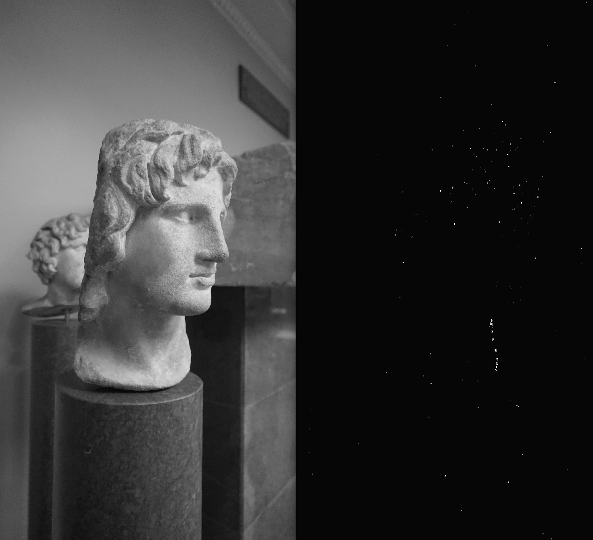
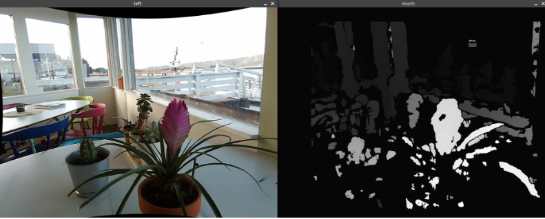

# Py-Photogrammetry
Creating a photogrammetry pipeline to go from multiple images of an object to an STL file. 

To use the pipeline, load all of your images into the "data" folder, and either run each of the implemented modules as a script which will generate a figure which visualizes some of the data processing which is performed by the functions in the module. 

## Project Goals
The original goal of this project was to create a python implementation for photogrammetric scanning of real-life objects by using OpenCV. This implementation would have been based on the Meshroom Photogrammetry Pipeline. 

Originally I aimed to re-create all steps of the photogrammetry pipeline. How can you take a set of images, back-solve for their relationships to each other and relative positions, and combine the data that these pictures show you to get a 3D occupancy grid of which represents the subject? This turned out to be overly ambitious. While each of the steps of the meshroom photogrammetry pipeline were analyzed and prepared for implementation, only the first steps of feature identification and image-to-image closest match pairing were performed. 

The linking of images to their closest match is the first step to creating the datapoint-links that are necessary to create and validate information about individual points of a final occupancy model. This work is a step towards a photogrammetry pipeline, but if you want to use a photogrammetry pipeline in python please use Meshroom or other more fleshed out implementations. 

## Method
### Feature Extraction

Features are portions of the scene of an image which are deemed relatively invariant of viewing angle and lighting condition and used as benchmarks to compare images. 

There are multiple prevailing feature-extraction algorithms, the most well-known being SIFT (scale invariant feature transform) and SURF (speeded up robust features). As both of those are proprietary patented algorithms, this implementation is built from OpenCV's ORB (oriented FAST and rotated BRIEF) feature-extraction method. 

### Image-Matching

Once each file has been mapped to its respective features, these lists of features can be compared to see which images match the most closely to each other. Based on which types of images you are processing (many small details, few large details, surface finish, etc) the threshold for a valid feature match can be lowered or raised (by setting a threshold for percent certainty). As you feed individual images to this step of the pipeline, you receive the image which you can use as the most viable stereo pair for depth mapping and other operations like feature comparison. 

### Depth-Mapping

Once we have the closest-match images, you can compare each pair to generate a depth map. Depth maps operate by first using the undistorted images and known camera intrinsics to calculate the camera extrinsic properties, or the movement of the camera through the scene between the two images. With this information, each feature point on the image can be considered to be a ray going from the transformed camera origin into the point. By comparing the intersection of these rays traveling away from each of the extrinsically placed camera positions in 3D space, 3D coordinates relative to the cameras can be identified to create a depth map of the scene.

DISCLAIMER: depth maps only work on undistorted images, because they rely on ray-collision on undistorted points to generate points of known depth. Because the images provided in this dataset are from a camera of unknown intrinsics, depth mapping and further exploration of this pipeline are infeasible. If you want for this step of the pipeline to perform as expected, undistort the images by using the camera intrinsics first. The plants depth map is with images undistorted by intrinsics on this page (https://albertarmea.com/post/opencv-stereo-camera/)

## Design Decisions
In terms of major design decisions, I believe that this project is more exemplary for its structure than for its implementation. I entered into this project with no understanding of image-processing or the concept of features to compare images in an algorithmic space. By the end, I felt confident in impelmenting individual pipeline-steps thanks to the methods that I had developed in the earlier stages of accumulating, storing, and planning with documentation and external resources in mind. When learning to use new packages like OpenCV half of the game is to remember what's possible and which types of operations the package supports. By finding other implementations of the more complex facets of this project, I was able to progress much faster than I would have been otherwise. 

I chose to implement this solution modularly, so that each module would rely on the previous modules but they could be developed in a siloed fashion. I made it so that each module was made up of functions which could operate on the images within the dataset independently. Although I only got the chance to implement three modules, I scaffolded out the steps to implementing each of the modules necessary for the full meshroom photogrammetry pipeline. 

## Challenges
The main challenge of this project was the sheer magnitude of tasks required to implement a full photogrammetry pipeline in 2 weeks, on top of the large initial time investment into problem identification and planning. There was simply a lot to do, and half of the work was to understand what needed doing. 

The largest annoyance in implementation was hardcoded values causing unintentional misdiagnosis or over-diagnosis of problems with the code. Many hours were wasted on pointless pursuits of nonexistent bugs because the wrong image was being displayed or not enough information was being printed for a correct output to be interpreted. In the future I will address this by attempting to keep from using "magic numbers" and hardcoded values to indicate which of the subsets of my data to display. 

## Improvements
Implementing a camera-calibration workflow and data-collection workflow would be the pre-requesite to any continued work on this tool. After that, aligning depth maps and creating individual point data-validation-pipelines where data is collected and compared about each 3D point to validate and create the mesh will bring you the rest of the way. Consulting meshroom documentation is helpful, but where that implementation is a scalpel this implementation is a butcher knife. Sometimes it is better to follow the spirit of the law than the letter. 

## Takeaways
Biting off more than you can chew can be a rewarding experience if you embrace the possibility of not reaching your goals in the ways that you had expected. The roadblocks in this project were obvious in hindsight, but it was a worthwhile experience nonetheless for the opportunitites to learn more about the possibilities of OpenCV